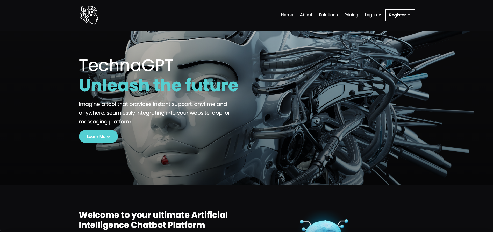
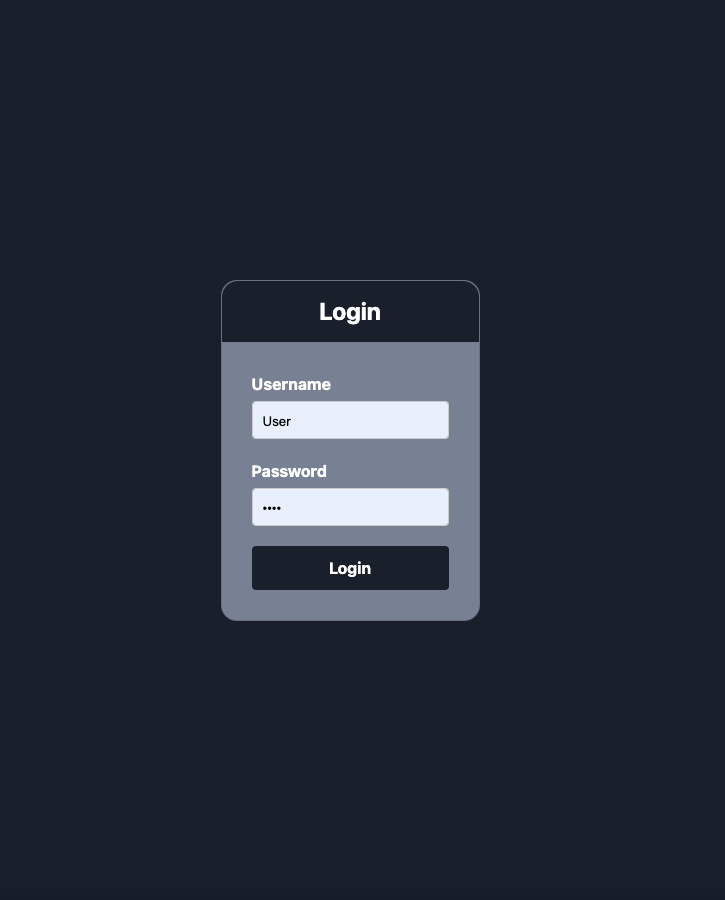
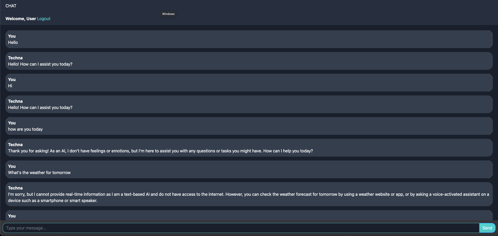

# TechnaGPT
A django based chatgpt clone with landing page, login system and chatbot history

# Usage
Make sure Django is installed which can be installed with `pip install django`.
After cloning the repository to your computer cd into TechnaGPT directory and run `python3 manage.py runserver`.
Copy the local url or ip address `127.0.0.1:8000` and paste it on your browser.
